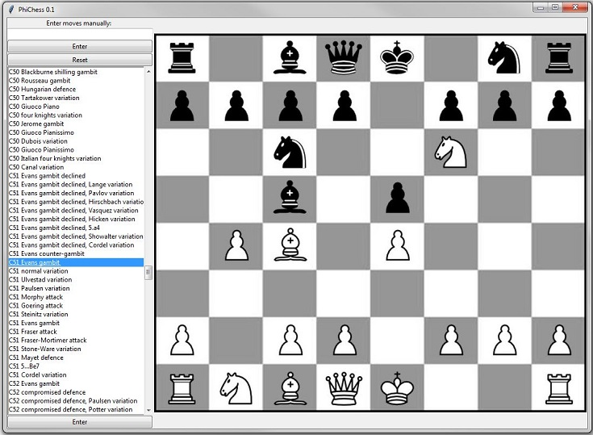

# Phichess
A(n unfinished) GUI for exploring chess openings as generated single file images.

Written in Python (3.4)

Completed thus far: 
* a main.py file for interacting with the program through a command line (view, reset, move, etc...).  
* displaying the chessboard objects as unicode 
* render images of chess positions using [Pillow](https://github.com/python-pillow/Pillow). 
* use listbox widget to locate and render a chess opening image

TO DO: 
* finish interpreter (validator.py) for chess algebraic notations (e.g., "Rg1" = "Rook to G1") 
* add buttons for: undoing a move, saving an image, and copying the notation to clipboard
